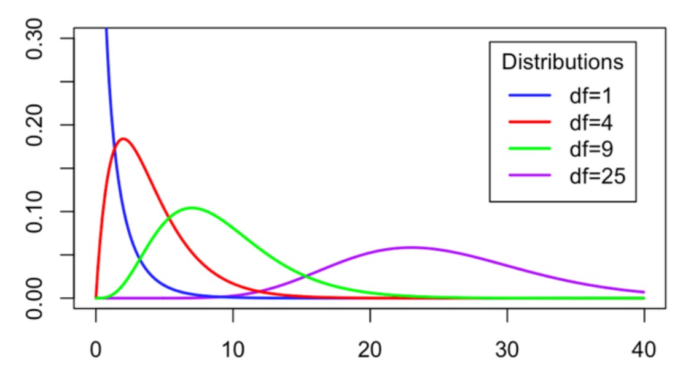

```{r setup, include=FALSE}
knitr::opts_chunk$set(echo = TRUE)
```

### Learning Objectives
1. Learn about the Chi-square distribution
2. Understand the ideas of various Chi-square tests
3. Create tables for the observed counts
4. Run a Goodness of Fit Test
5. Run a Test of Independence

### Functions
1. `table()`
2. `chisq.test()`


***


## Statistical Review

### Exploring Categorical Data

We have been working a lot with quantitative variables (population means and linear regression). For this lab, we will shift back to analyzing categorical data (specifically count data). The two main tests we will cover are:

1. **Chi-Square Goodness of Fit Test**: assesses if a specified model is a good fitting model for a categorical variable with more than two categories

2. **Chi-Square Test of Independence**: assesses if two discrete (categorical) variables are independent among a population of interest

Both tests are based on a Chi-square test statistic that follows a Chi-square distribution. 


### Chi-Square Distributions

A Chi-square distribution takes on a very different shape compared to our t and z distributions. It is *strictly positive* and (typically) *skewed to the right*. The specific shape of the distribution depends on the degrees of freedom (df), as seen below.

{width=300px}

Some important properties of this distribution are:

- Mean: E(chisq) = df
- Standard Deviation: sd(chisq) = sqrt(2*df) 

You can calculate probabilities and cut-off values using the `pchisq()` function and `qchisq()` function, respectively. Example of these functions can be found in the lecture notes!


***

## Coding Examples

### Goodness of Fit Tests

So what is the big idea with Chi-square tests? It is the analysis of count data (the number of observations that belong to different groups or different combinations of groups).

To run a Chi-square analysis...
- Create a null hypothesis that we wish to test
- Calculate the counts we would *expect* to see if H0 were true
- Compare these *expected* counts to what we *observed* from the sample data
- The more the expected and observed counts differ, the larger the X^2 test statistic
- The larger the X^2 test statistic, the smaller the p-value 
- The smaller the p-value, the more evidence against H0 (and in favor of Ha)

For a *Goodness of Fit Test*, we look us assess if a particular discrete model is a good fitting model for a discrete characteristic. With this scenario we collect one sample of data (representing one population) and record the counts of one categorical variable.  

Let's use our `penguins` data set one last time.

```{r readPenguins}
penguins <- read.csv("penguins.csv")
```

We will assume that this collection of penguins is a random sample that is representative for all penguins (of these three species).

Suppose we wish to test if the distribution of penguin species fits the following proposed model:

H0: p_Adelie = 0.4, p_Chinstrap = 0.2, p_Gentoo = 0.4 


Think About It: Given a sample size of 333 penguins, how many of each species would we expect to see assuming the above distribution was correct?

```{r expectedCounts}
333*0.4
333*0.2
333*0.4
```


How many did we actually observe? We can use the `table()` function to find out!

```{r tableSpeciesObservedCounts}
table(penguins$species)
```

If we compare the *observed counts* (from our table) to the *expected counts* (above the table), we would notice that they are quite different. The counts aren't too far off... 


Let's run a Chi-square Goodness of Fit Test to determine if our null model is a good fit for the distribution of penguin species. To do this, we can use the `chisq.test()` function. 

```{r chiSquareSpecies}
chisq.test(table(penguins$species), 
           p = c(0.4, 0.2, 0.4))
```

We supply this function with two arguments:

- the table of penguin species
- the hypothesized proportions

Be careful with all of the parentheses! Also, by default, R puts species (or groups) in alphabetical order. So we have to be careful with the order of our hypothesized probabilities.

Our resulting X^2 test statistic is 2.7733 and the corresponding p-value is 0.2499.

*Evaluation:* With a p-value of 0.2499, we do not have enough evidence against the null hypothesis.

*Conclusion:* We do not have enough evidence to conclude that the null model (p1 = 0.4, p2 = 0.2, p3 = 0.4) is not a good fitting model for the species variable from our population of penguins. 

The conclusion can seem weird as a double negative, but we should always write the conclusion in terms of the alternative hypothesis.


**Demo #1:** Suppose we wanted to determine if the distribution of where penguins live (which island) fits the following model:

H0: p_Biscoe = 0.5, p_Dream = 0.3, p_Torgersen = 0.2

Use the `chisq.test()` and `table()` function to decide if we have evidence against this hypothesis. 

```{r demo1, error = T}
# Replace this text with your code

```

Think About It: How would you evaluate the p-value?


### Test of Independence

A test of independence is similar, but now involves *two* categorical variables. We wish to assess if two categorical variables are independent or if there is an association between them.

This test also compares the observed counts with the expected counts. If they differ by enough, we will conclude that there *is* an association between the categorical variables.

Suppose we wish to determine if there is a relationship (or association) between the species of a penguin and the sex of a penguin. To find the observed counts, we would now need a two-way frequency table (also known as a contingency table). 

```{r twoWayTableObservedCounts}
table(penguins$sex, penguins$species)
```


Similar to the Goodness of Fit Test, we would compare these observed counts to the expected counts. To find the expected counts, we will need the `chisq.test()` function. 

```{r chisqExpectedCounts}
chisq.test(table(penguins$sex, penguins$species))$expected
```

This is a strange setup...so be careful with where the parentheses are and where the dollar sign goes. We can see, however, that the observed counts from above are *very* similar to the expected counts calculated here.


To run the Test of Independence, we simply remove the `$expected` from the previous code chunk.

```{r chiSquareSexSpecies}
chisq.test(table(penguins$sex, penguins$species))
```

Our p-value is *very* large in this example.

*Evaluation:* With a p-value of 0.976, we do not have enough evidence against the null hypothesis. 

*Conclusion:* We do not have enough evidence to suggest an association between sex and species for the population of penguins represented by this sample. 


**Demo #2:** Suppose we wanted to assess if there was an association between the species of the penguin and where the penguins live (island). 

First, create a two-way table that tabulates the *observed* counts.

```{r demo2a, error = T}
# Replace this text with your code

```

Then, compute the *expected* counts.

```{r demo2b, error = T}
# Replace this text with your code

```

Finally, run the Test of Independence

```{r demo2c, error = T}
# Replace this text with your code

```

Think About It: Based on the sample, would we be able to conclude that there is an association between the species of the penguin and where the penguin lives (for the population of penguins represented by our sample)?


That's it for Lab 8! Click on the file titled `lab08assignment.Rmd` in the bottom right window to open up the lab assignment. Please note that there is also a file titled `lab08functions.Rmd` that may be helpful for completing the lab!


